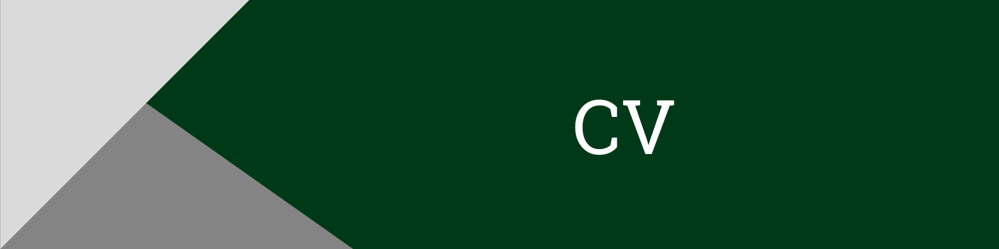
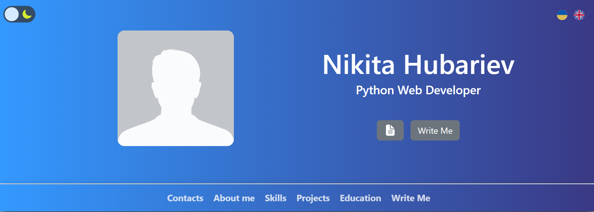
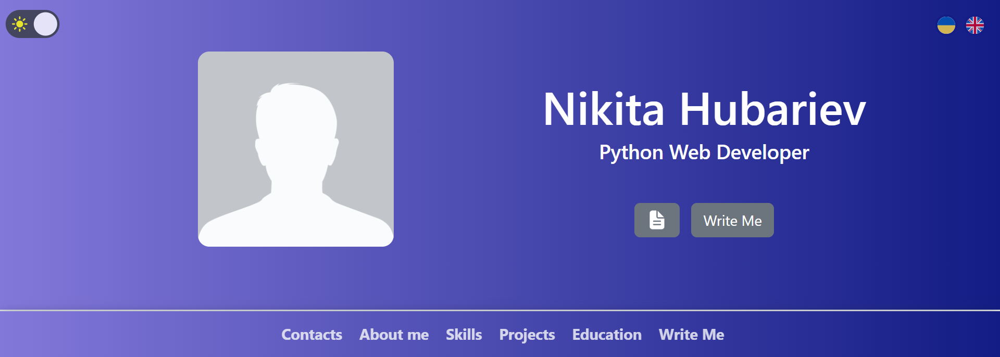
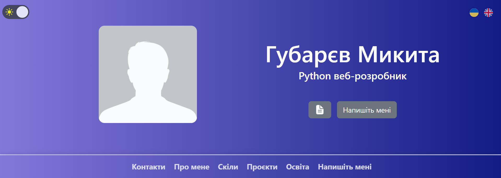

_My CV site_

## Demo

Click **<a href="https://hubariev.com" target="_blank">here</a>** to open my CV site

## Features

There are the following sections on the site:

-   Contacts
-   About me
-   Skills
-   Projects
-   Education
-   Write me

### Dark theme

There is a theme toggler between light and dark themes.

### Translation into Ukrainian

There is the ability to switch the site into Ukrainian.

